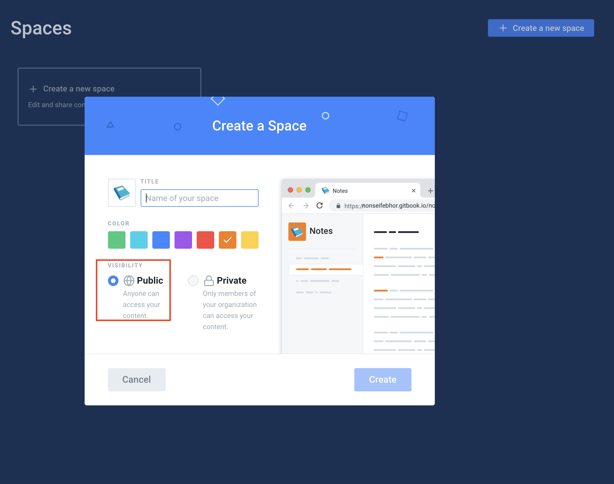
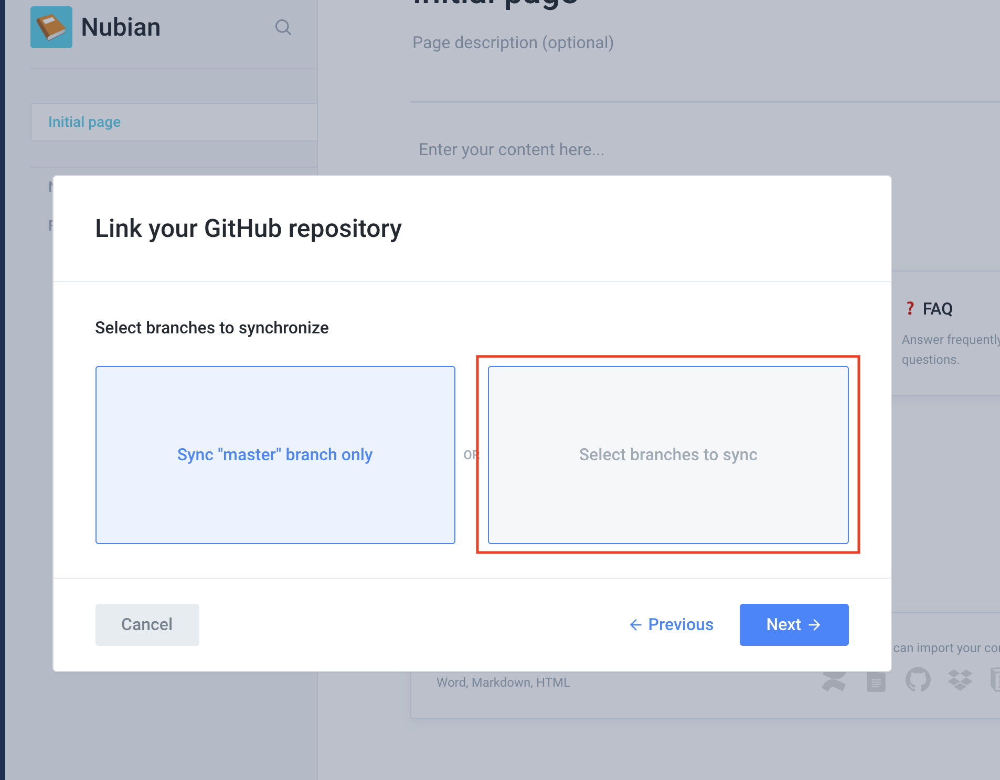
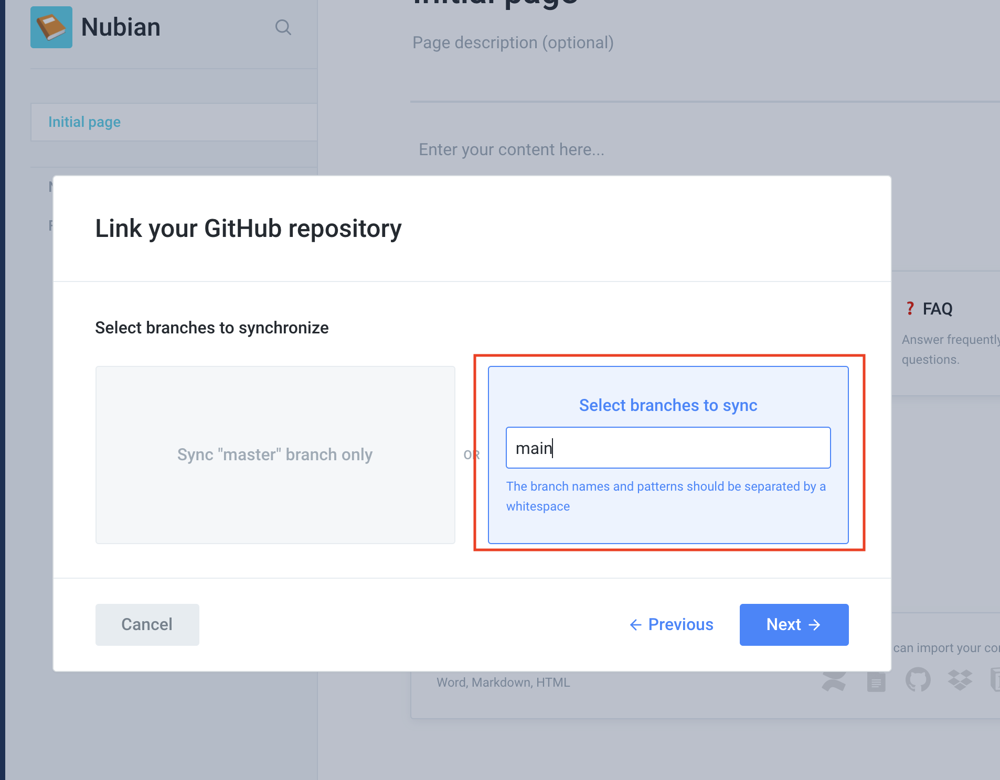
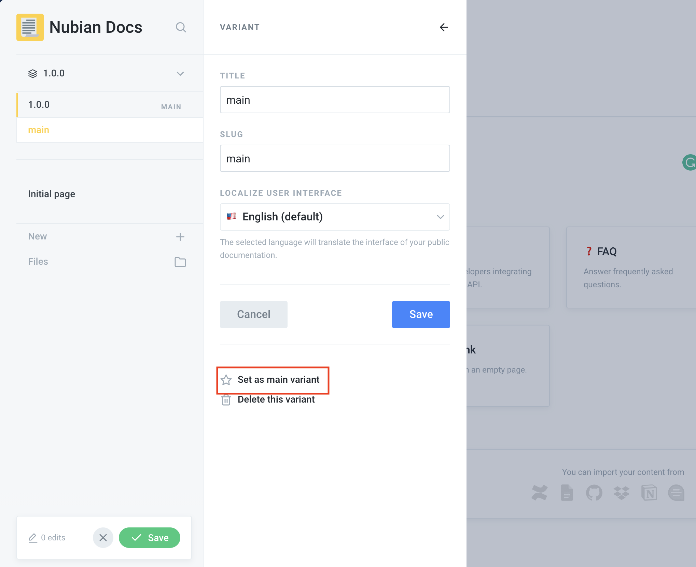

# Content/Technical Writers

As you already know, our documentation is hosted on Gitbook. To contribute you can simply select the "Edit on Github" button on the right menu and do your thing although this would need Markdown knowledge. You can also contribute directly on Gitbook, you will have to have an account on Gitbook. No special skill is needed to use Gitbook it's very simple and intuitive. We encourage you to make only necessary changes, you can contribute by removing repetitions, correcting grammar or rewriting whole paragraphs. Here's a guide on how to get started contributing it shows you how to set up Gitbook for your changes.

#### 1. Fork the Nubian-docs repository

You should already have an account on [Github](https://github.com). Fork the [Nubian-docs](https://github.com/Open-Currency-Collective/Nubian-docs) repository to your personal account and move on to the next step.

#### 2. Sign up or sign in to Gitbook

If you don't have an account already signup on Gitbook using your Github account. Just go to [Gitbook](https://gitbook.com) and click on the "Signup with Github" button to create an account. Do use the account you use to fork the Nubian-docs.

#### 3. Create a space on Gitbook

Gitbook spaces are places where you can organise related documents. When you sign in you can easily create a space with the "+ Create a new space" button. Give the space whatever name you choose and make it public.

#### **4. Add Github to your space|**

Add Github to your space to see the already existing documentation and modify it directly from Gitbook. On the sidebar menu, you will see "integrations", select it and select the "Github" integration option. You will be given an option to choose between just public or all repositories on the Github account to show so you can select one. Select the repository you forked from the dropdown menu and move on to step 5.

#### 5. Select the branch.

Pick the "select branches to sync" option and enter main as the branch to sync from and choose the first sync to come from Github. Follow the images below.\

.png>)

#### 6. Set main branch as the main variant.

Gitbook uses variants for versioning and automatically creates the main variant for your Github integration. Change the current integration from 1.0.0 to main from the top left menu on the docs itself to see the docs on your forked repository.

#### 7. Save and merge your changes

Save and merge your changes on Gitbook to save them on Github.

#### 8. Make a pull request

When you are done with applying your changes create a pull request with a descriptive title and add the links to the changes you made in your Gitbook instance. To get the links, check the Share menu item on the Gitbook side menu.

We can't wait for your pull requests. Happy Writing 🎉. 

