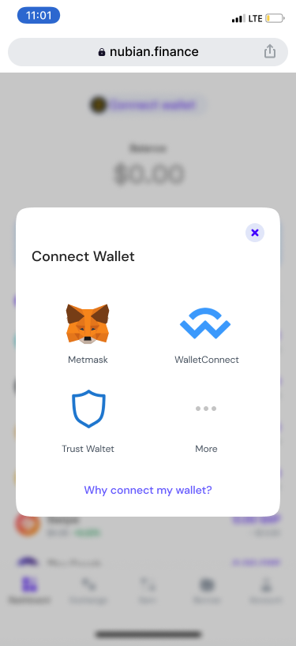

# Connect to Nubian

When you land on Nubian you are first greeted with an empty dashboard. 

To move forward you have to connect your wallet to the Nubian decentralized application (dapp) and choose your experience level. 

### Connect your wallet

Remember when you are always required to sign in to an application to access your profile? It's synonymous with connecting your wallet. When you connect your wallet you are signing in, we can show you your available assets, past activities and you can start earning or swapping your tokens. You need a desktop browser with a DeFi wallet extension or a mobile wallet with a dapp browser, check the [wallets](wallets.md) part of this guide to learn about them and get one if you haven't. Here's how to connect your wallet.

1. Click on the connect wallet button to choose your wallet and pick your preferred wallet. You will be prompted on the wallet to let Nubian connect to it, accept the connection request.

2\. When you successfully connect your wallet you'll see your address at the top with all your available assets under the Assets tab and your past transactions under the Transactions tab.

.svg>)

Immediately after connecting your wallet, you have to [choose your experience level](choose-your-experience-level.md).
