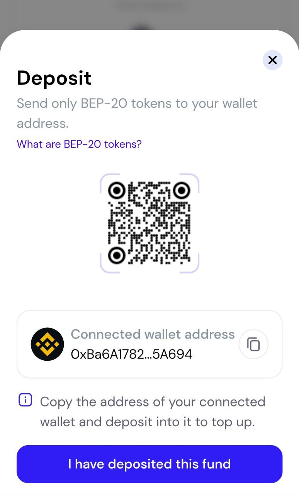

# 💵 Fund your Wallet

After connecting your wallet you are shown your dashboard, which shows the total value of the cryptocurrency you have. The total value is zero if your wallet is empty.

&#x20;                                 __                                  .jpg>)__

&#x20;                                                                   _****_                                                                    Dashboard

__

To start using Nubian to save, you need to have the cryptocurrency you want to save. Let's fund our wallet with BNB it's the same process for funding with any other token. Curious why we chose BNB? The Nubian app is built on the BNB Smart Chain and requires BNB for transaction fees so you always need BNB.

To receive cryptocurrency you are required to share your wallet address or a QR code representation of it.&#x20;

To see the address and QR code, just select the Fund your Account Card on your dashboard,

&#x20;                                               _****_                                                .jpg>)_****_

&#x20;                                                                    _****_**                                                                      ** Fund your account card

The popup comes up when you select the "Fund your account" card. This shows your address and the QR code representation of it. You can send the cryptocurrency directly to the address or scan the QR code.&#x20;

&#x20;                                         

&#x20;                                                                        _****_                                                                         Address popup

_****_

If you have crypto buddies you can share your address with any of them to send you BNB. If you want to convert your cash or fiat to crypto instead, let's do it together.


Always make sure the BNB sent to your wallet address is **BEP-20** and not BEP-2. BNB (BEP-20) is used on the **BNB Smart Chain** where Nubian is deployed, while BNB (BEP-2) is used on the BNB Beacon Chain, we do not need it.


### Converting fiat to Crypto

There are various methods to convert the cash or fiat in your possession to cryptocurrency. Here are a few of them. This is meant to be a short guide so we'll be looking at the one we think will be the fastest.

**P2P**

You can buy directly from someone this involves sending or giving the person money and he gives you the equivalent value in cryptocurrency in return. This method prevents personal information from being exposed. A popular platform that supports BNB and has a P2P service is the [Binance](getting-started.md) P2P platform although you still have to create an account and do Know Your Customer (KYC).

**Centralised Exchanges**

To buy cryptocurrency from a centralised exchange requires you to signup on these exchanges, complete KYC, deposit cash, exchange your cash for BNB and then withdraw that BNB to your external wallet. [Binance](https://binance.com) and [Hotbit](https://www.hotbit.io) are good examples of exchanges that support this.

**Credit/Debit Cards**

You can buy cryptocurrency using your credit/debit card. It's one of the fastest means of getting cryptocurrency, although it does expose your personal details on your credit card to the company you are buying from. We'll go through a simple guide to buying BNB from [Moonpay](https://www.moonpay.com). Moonpay makes the process very easy you can also use other alternate services that let you buy BNB to your wallet.

1.  Go to [Moonpay](https://moonpay.com).\

    &#x20;                                          \
    \

2.  Select the token you want to buy and enter the amount. Make sure to select BNB (BEP20) as shown below.\

    &#x20;                                           \

3.  Enter the wallet address from the Nubian app and select the "Continue" button.\

    &#x20;                                           \

4.  Enter your email.\

    After entering your email, if you have an account with Moonpay you'll be immediately given the option to pay with your already saved card details else you'll have to enter your card details and complete the payment.\

    &#x20;                                            \

5. When you complete payment you should see your tokens appear on your dashboard although this might take some time.\
   \
   _Dashboard with tokens._\

Yay! :partying\_face:, now that you've funded your wallet let's start interacting with the Nubian application.
