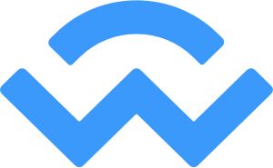

# 💰 Get a Wallet

When you open the Nubian app, you are greeted with this screen below after selecting the "Get Started" button, to get started you need to connect a wallet. Let's get you a wallet if you do not have one, if you have a wallet you can connect your wallet and start using Nubian.\

&#x20;                                                  .jpg>)  &#x20;

A wallet is a software that holds the details you need to send and receive cryptocurrency and make other transactions. It's just like your bank application only that it's under your complete control and does not help you store and spend US dollars, Naira or other forms of government monies but cryptocurrencies. Popular examples of wallets are Trust wallet and Metamask.

Wallets hold keys that enable you to spend your cryptocurrency. These keys include your private keys and a mnemonic seed phrase (a sequence of 12 or 24 words), they are meant to be kept secret and known only by you. These keys are analogous to your credit/debit card pin you always want to keep private and are wary to enter on malicious websites. If they get compromised, the attacker can spend your funds. Your wallet also has an address which is a group of characters typically beginning with '0x' that is used to receive funds.


With great power comes great responsibility. The funds in your wallet are now under your complete control, make sure access to these funds are always kept safe and never made public or else **you will lose your funds.**


When you first open a new wallet you are shown your recovery phrase make sure to write it in a safe and secure place to allow you to restore your wallet or import it if your device gets somehow stolen or wiped.


Don't forget to store your recovery phrase or private key somewhere safe, you can restore your wallet if you misplace it using your recovery phrase or private key.


To interact with Nubian Finance you need to have a Decentralized Finance (DeFi) wallet. A DeFi wallet does everything a normal wallet does and also enables you to interact with Decentralized Applications (Dapps).

There are multiple DeFi wallets for different platforms. Here are the wallets supported by Nubian Finance, categorised by platform.

## Web wallets

These can be used on desktop browsers.

### Metamask

The Metamask wallet is the most widely used DeFi wallet. It allows you to connect with many Decentralized Finance applications without requiring much setup. It is usually used as a browser extension with Firefox, Brave, Edge, and Chrome browsers.

[Add to your browser](https://metamask.io/download.html)

[Official Website](https://metamask.io)

### Binance

The Binance Wallet is an extension on the browser it works just like the Metamask wallet described above. It's on the Firefox, Brave, and Chrome browsers.

[Add to your browser](https://docs.binance.org/smart-chain/wallet/binance.html)

## Mobile wallets

These are mobile applications that both serve as a cryptocurrency wallet and come bundled with a decentralized application (dapp) browser that lets you interact with different DeFi applications like Nubian from inside your wallet.

### Trust wallet

This is one of the most widely used mobile wallets. It is well known for supporting a very large number of coins and tokens. It's Android version allows you interact with DApps using a Dapp browser.

[Download](https://trustwallet.com/download-page)

[Official Website](https://trustwallet.com)

### Metamask

In addition to their popular browser extension, Metamask also has a mobile wallet that lets smartphone users connect their wallets to the Nubian dapp and perform activities on it. It comes bundled with all the features of the browser extension.

[Download](https://metamask.io/download.html)

[Official Website](https://metamask.io)

### Wallet Connect

It's not a mobile wallet but is a service that lets you connect your mobile wallets like Metamask or Trustwallet to a dapp using QR codes. It requires no specific installation from you except owning a mobile wallet. Check the list below to see all the mobile wallets that support it. Owning anyone of these wallets means you can connect to Nubian without any further setup.

[Mobile wallets supporting Wallet Connect](https://registry.walletconnect.org/wallets)

[Official Website](https://walletconnect.org)
